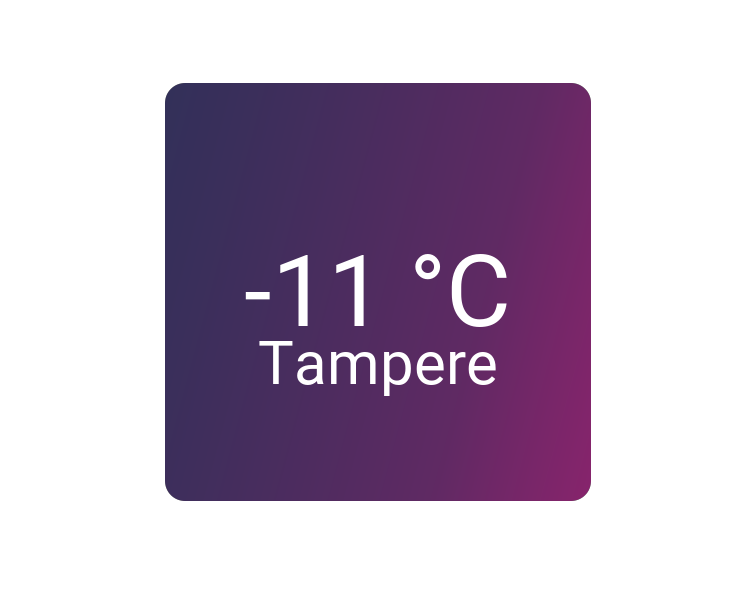

# API and Weather App
### Dont forget to insert api key to apikey.txt




```python
import weatherapi as api
api.weather(city, "temp"/"pressure"/"humidity"/"description")
```
I reccomend using ```round()``` on the result of this:
```python
api.toCelsius(x, "kelvin"/"fahrenheit")
```
